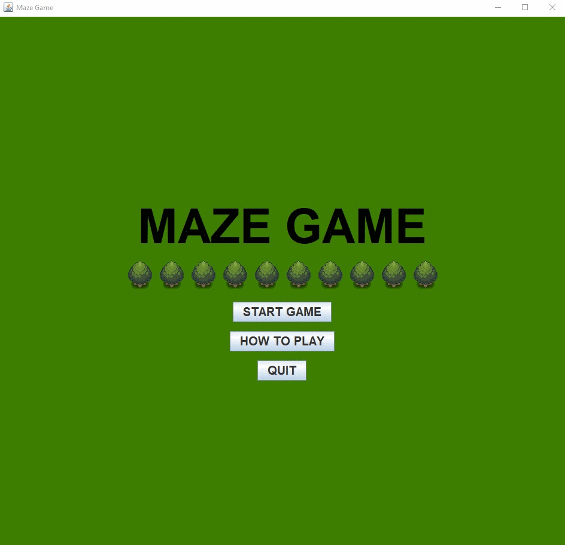
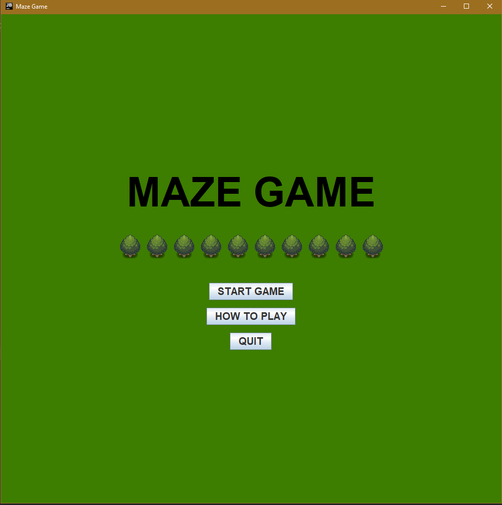
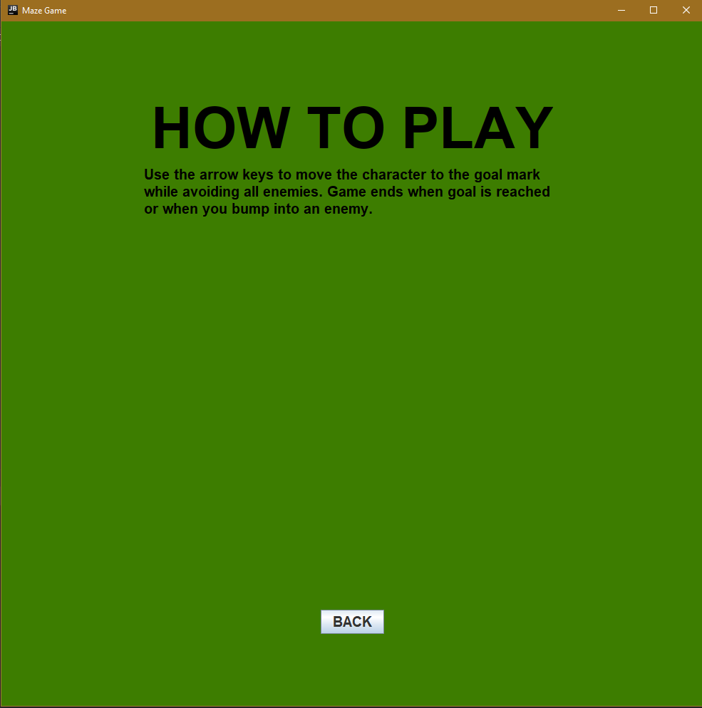
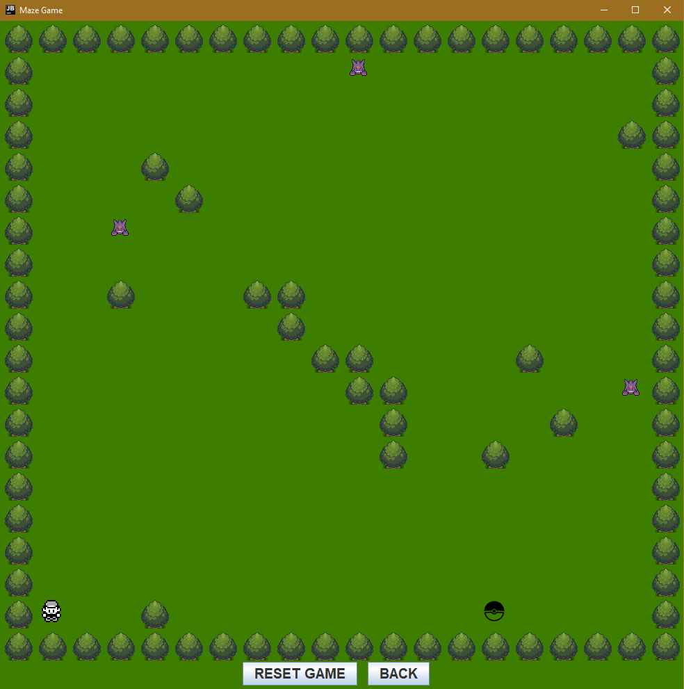
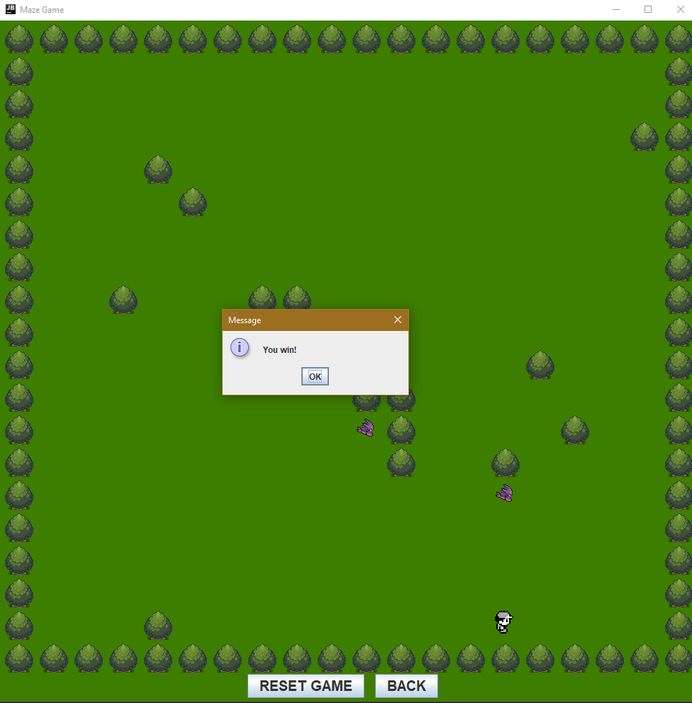
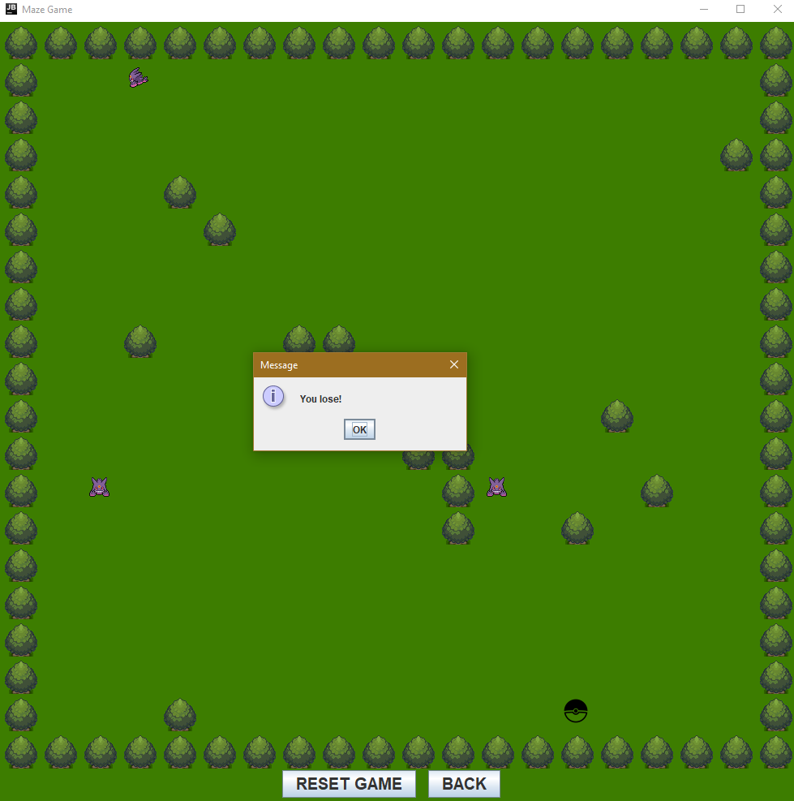
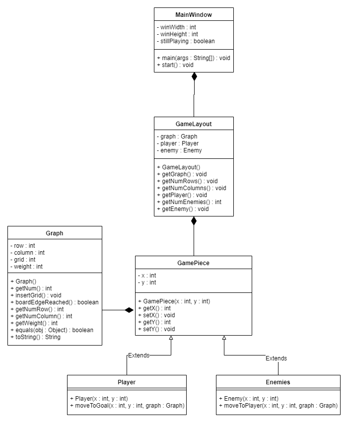
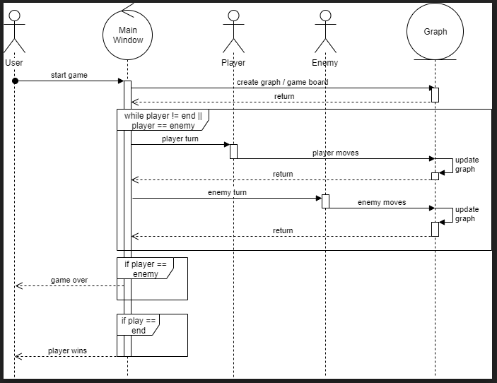

# Maze Game Final Group Project for CS113 - Graph

> Maze Game collaboration using Dijkstra's algorithm to find shortest path from enemy to player

[](https://travis-ci.org/doge/wow)
[](https://coveralls.io/r/doge/wow)
[](http://doge.mit-license.org)
[](https://github.com/badges/badgerbadgerbadger)



## Table of Contents
- [Features](#features)
- [Assignment Instructions](#assignment-instructions)
- [Project proposal/description](#project-proposal/description:)
- [Graph algorithm used](#graph-algorithm-used:)
- [Screenshot(s)](#screenshot(s):)
- [UML Class+Relationship Diagram](#UML-Class+Relationship-Diagram:)
- [Sequence Diagram (for driver)](#Sequence-Diagram-(for-driver):)
- [Team](#team)
- [License](#license)


## Features
Edit [obstacles.txt](./obstacles.txt) to change map/level trees/obstacles

Edit [World.java](./src/edu/miracosta/cs113/World.java) to change goal marker

> Change goal marker position
>```java
>private final int WINXPOSITION = 18 ;
>private final int WINYPOSITION = 1 ;
>```

> Change player start position
>```java
>player = new Player("Player one", 1,18);
>```

> Change number of enemies and their start positions
>```java
>private void addEnemies() {
>    this.addEnemy(10,1);
>    this.addEnemy(3,6);
>    this.addEnemy(18, 11);
>}
>```

## Assignment Instructions
Complete the `Graph` class, either as an adjacency list or adjacency matrix, per the ADT proposal in the lecture slides along with an advanced algorithm (Dijkstra's, Prim's, DFS, BFS, or some other one we haven't covered [clear with instructor first]).  Use the data structure in a core/useful way for your groups idea. Ideally (but not required), you should include a GUI frontend to showcase your project.

**Use Scrum (Agile) development to build your group project over 3 weeks:**
- Sprint 0 = planning sprint
	- End of sprint should have: project proposal/description, decide graph algorithm, initial UML + sequence diagram
- Sprint 1 = first half of development
- Sprint 2 = second half of development
	- End of sprint should have: project completed+documented, screenshots, updated UML+sequence diagrams
- *See past group projects for general sprint requirements (i.e., unit tests for each sprint, updated documentation, etc.)*

**You will be graded on the following:**
- Complete/updated UML Class and relationship diagram
- Complete/updated Sequence diagram for driver (main part of program that creates objects, does user input, etc.)
- JUnit tests for all model classes + data structure (Graph)
	- Note: GUI classes need not have JUnit tests
- All code documented (author boxes, algorithm for driver, methods have description/precondition/postcondition, class invariants)
- No crashes/compile issues
**- Every group member writes significant amount of code**, ideally proportional to other members.


> ***NOTE:***
> - You'll be tempted to push the project off for the end, or give certain group members monolithic parts (someone build the Graph, someone build the GUI, etc.).  **DON'T!**  Embrace the agile development process! Plan in Sprint 0, build a working product by the end of Sprint 1 and Sprint 2.
> - Trouble splitting up the UML/sequence diagram? Build them together! That way everyone's on the same page! 
> - Plan plan plan plan! When you're done planning, PLAN SOME MORE!
> - Create and use Trello boards, Slack, etc. to help you all communicate and organize yourselves

## Project proposal/description:
- A game in which the goal is to reach a specific point on the map before being hit by an enemy computer.
  The user controls the player using the keyboard arrow keys.
  The game will use Graphs to move the enemies closer to the player. 
  The game is won if the player succeeds in reaching the specified goal
  The game is lost if the player collides with an enemy.

## Graph algorithm used:
[Adjacency Matrix / Dijkstra's algorithm]
- We used Dijkstra's algorithm so the Enemy objects could track and and try and reach the player.
  Dijkstra's algorithm is a greedy algorithm that goes towards the closest path before even considering another one.
  After testing other paths available it moves towards its objective using the shortest path found.

## Screenshot(s):







## UML Class+Relationship Diagram:


## Sequence Diagram (for driver):


## Team
| <a href="https://github.com/karina-15" target="_blank">**Karina Elias**</a> | <a href="https://github.com/JuanHdzD" target="_blank">**Juan Hernandez Diaz**</a> | <a href="https://github.com/AlfredoHernandezJr" target="_blank">**Alfredo Hernandez Jr.**</a> |
| :---: |:---:| :---:|
| [](https://github.com/karina-15)    | [](https://github.com/JuanHdzD) | [](https://github.com/AlfredoHernandezJr)  |
| <a href="https://github.com/karina-15" target="_blank">`github.com/karina-15`</a> | <a href="https://github.com/JuanHdzD" target="_blank">`github.com/JuanHdzD`</a> | <a href="https://github.com/AlfredoHernandezJr" target="_blank">`github.com/AlfredoHernandezJr`</a> |

## License
[](http://doge.mit-license.org)

- **[MIT license](http://opensource.org/licenses/mit-license.php)**
- Copyright 2015 © Karina Elias, Juan Hernandez Diaz, Alfredo Hernandez Jr.